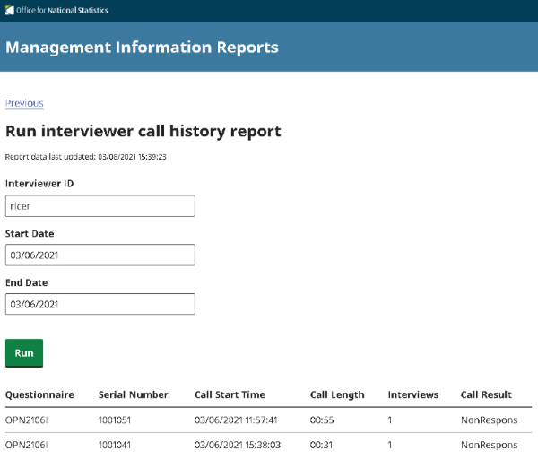
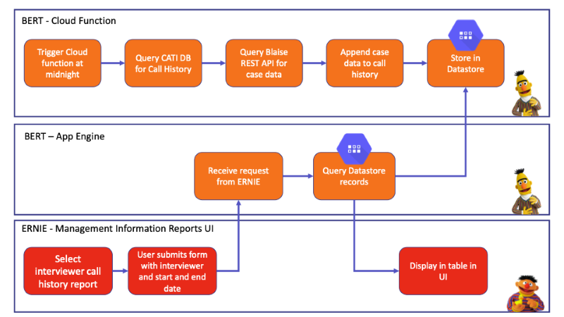

# Blaise Management Information Reports 


[](https://codecov.io/gh/ONSdigital/blaise-management-information-reports)

[](https://github.com/ONSdigital/blaise-management-information-reports/pulls)

[](https://github.com/ONSdigital/blaise-management-information-reports/commits)

[](https://github.com/ONSdigital/blaise-management-information-reports/graphs/contributors)

Web-based user interface for running and viewing management information reports.



This project is a React.js application which when built is rendered by a Node.js express server.

The application is being deployed to Google App Engine.

The application calls API endpoints from the BERT application to receive the management information data.



## Local Setup

Prerequisites:

- [Node.js](https://nodejs.org/)
- [Yarn](https://yarnpkg.com/)
- [Cloud SDK](https://cloud.google.com/sdk/)

Clone the repository:

```shell
git clone https://github.com/ONSdigital/blaise-management-information-reports.git
```

Create an .env file in the root of the project and add the following variables:

| Variable | Description | Example |
| --- | --- | --- |
| PROJECT_ID | The Google Cloud project ID for the environment the app is running against. | blah |
| BERT_URL | The base URL for [BERT](https://github.com/ONSdigital/blaise-export-reporting-tool), used to retrieve report data from BERT API endpoints. | https://dev-<sandbox>-bert.social-surveys.gcp.onsdigital.uk |
| BERT_CLIENT_ID | The client ID For authenticating with [BERT](https://github.com/ONSdigital/blaise-export-reporting-tool) | foo.apps.googleusercontent.com |
| BLAISE_API_URL | The base URL for our [Blaise RESTful API](https://github.com/ONSdigital/blaise-api-rest), used to auth into the app. | http://localhost:1337 |

Example .env file:

```
PROJECT_ID = 'ons-blaise-v2-dev-<sandbox>'
BERT_URL = 'https://dev-<sandbox>-bert.social-surveys.gcp.onsdigital.uk'
BERT_CLIENT_ID = 'foo.apps.googleusercontent.com'
BLAISE_API_URL = 'http://localhost:1337'
```

To find the `BERT_CLIENT_ID`, navigate to the GCP console, search for `Identity-Aware Proxy`, click the three dots on right of the `BERT` service and select `OAuth`. the `Client Id` will be on the right.

Install the project dependencies:
```shell
yarn install
```

Running yarn or yarn install will install the required modules specified in the yarn.lock file.

The versions of theses modules are fixed in the yarn.lock files, so to avoid unwanted upgrades or instability caused by incorrect modifications, DO NOT DELETE THE LOCK FILE.

More information about yarn (https://confluence.ons.gov.uk/x/zdwACQ)

Authenticate with GCP:
```shell
gcloud auth login
```

Set your GCP project:
```shell
gcloud config set project ons-blaise-v2-dev-<sandbox>
```

Open a tunnel to our Blaise RESTful API in your GCP project:
```shell
gcloud compute start-iap-tunnel restapi-1 80 --local-host-port=localhost:1337 --zone europe-west2-a
```

Download a service account JSON key:
```shell
gcloud iam service-accounts keys create keys.json --iam-account ons-blaise-v2-dev-<sandbox>@appspot.gserviceaccount.com
```

Temporary set your local GOOGLE_APPLICATION_CREDENTIALS environment variable to this JSON file:
```shell
Unix: export GOOGLE_APPLICATION_CREDENTIALS=keys.json
Windows: set GOOGLE_APPLICATION_CREDENTIALS=keys.json
```

Run Node.js server and React.js client via the following package.json script:
```shell
yarn dev
```

The UI should now be accessible via:

http://localhost:3000/

## Running Jest Tests

Jest tests can be run via the following package.json script:
```shell
yarn test
```

Tests can be run without sending all messages to the console by adding the following flag:
```shell
yarn test --silent
```

Test snapshots can be updated by adding the following flag:
```shell
yarn test -u
```

## Running Playwright Tests

Create an .env file in the root of the project and add the following variables:

| Variable | Description | Example |
| --- | --- | --- |
| CATI_URL | The URL for CATI | https://dev-<sandbox>-cati.social-surveys.gcp.onsdigital.uk |
| REPORTS_URL | The URL for ERNIE | https://dev-<sandbox>-reports.social-surveys.gcp.onsdigital.uk |
| REST_API_URL | The base URL for our [Blaise RESTful API](https://github.com/ONSdigital/blaise-api-rest), used to auth into the app. | http://localhost:1337 |
| SERVER_PARK | The name of the server park | gusty |
| TEST_QUESTIONNAIRE | The name of the test questionnaire in the DQS bucket (this questionnaire needs to be configured for appointments) | DST2304Z |

Example .env file:

```
CATI_URL = 'https://dev-<sandbox>-cati.social-surveys.gcp.onsdigital.uk'
REPORTS_URL = 'https://dev-<sandbox>-reports.social-surveys.gcp.onsdigital.uk '
REST_API_URL = 'http://localhost:1337'
SERVER_PARK = 'gusty'
TEST_QUESTIONNAIRE = 'DST2304Z'
```

Authenticate with GCP:
```shell
gcloud auth login
```

Set your GCP project:
```shell
gcloud config set project ons-blaise-v2-dev-<sandbox>
```

Open a tunnel to our Blaise RESTful API in your GCP project:
```shell
gcloud compute start-iap-tunnel restapi-1 80 --local-host-port=localhost:1337 --zone europe-west2-a
```

Install the latest Playwright browsers if necessary:
```shell
yarn run playwright install
```

Run the tests headless (console only):
```shell
yarn run playwright test tests
```

Run the tests headed (visible browser):
```shell
yarn run playwright test tests --headed
```

## Using Playwright Trace Viewer

Playwright offers a trace viewer that facilitates test playback. This can be very useful for debugging purposes.

To run Playwright with trace enabled:
```shell
yarn run playwright test tests --trace on
```

This will generate a separate trace.zip file for each test, these files will be stored within subfolders located in the test-results directory.

To view the trace:
```shell
yarn run playwright show-trace test-results/<test-sub-folder>/trace.zip
```

Tests run within the Concourse worker's remote container might behave differently than when run locally. You can use the Concourse "fly hijack" command to download the trace.zip file from the remote container. You can then view the downloaded trace locally via the trace viewer.

Download trace.zip from remote container:
```shell
fly hijack \
--target <fly-target> \
--build <build-number> \
--job blaise-deploy-dev/mir-test \
--step mir-integration-test \
cat mir-git/test-results/<test-sub-folder>/trace.zip > ./trace.zip
```
