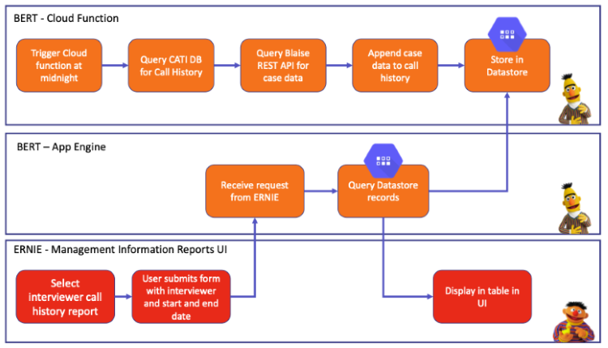

# Blaise Management Information Reports 


[](https://codecov.io/gh/ONSdigital/blaise-management-information-reports)

[](https://github.com/ONSdigital/blaise-management-information-reports/pulls)

[](https://github.com/ONSdigital/blaise-management-information-reports/commits)

[](https://github.com/ONSdigital/blaise-management-information-reports/graphs/contributors)

Web-based user interface for running and viewing management information reports.


This project is a React.js application which when built is rendered by a Node.js express server.

The application is being deployed to Google App Engine.

The application calls API endpoints from the BERT application to receive the management information data.



## Local Setup

Prerequisites:

- [Node.js](https://nodejs.org/)
- [Yarn](https://yarnpkg.com/)
- [Cloud SDK](https://cloud.google.com/sdk/)

Clone the repository:

```shell script
git clone https://github.com/ONSdigital/blaise-management-information-reports.git
```

Create an .env file in the root of the project and add the following variables:

| Variable | Description | Example |
| --- | --- | --- |
| PROJECT_ID | The Google Cloud project ID for the environment the app is running against. | blah |
| BERT_URL | The base URL for [BERT](https://github.com/ONSdigital/blaise-export-reporting-tool), used to retrieve report data from BERT API endpoints. | https://dev-<sandbox>-bert.social-surveys.gcp.onsdigital.uk |
| BERT_CLIENT_ID | The client ID For authenticating with [BERT](https://github.com/ONSdigital/blaise-export-reporting-tool) | foo.apps.googleusercontent.com |
| BLAISE_API_URL | The base URL for our [Blaise RESTful API](https://github.com/ONSdigital/blaise-api-rest), used to auth into the app. | http://localhost:90 |

Example .env file:

```
PROJECT_ID = 'ons-blaise-v2-dev-<sandbox>'
BERT_URL = 'https://dev-<sandbox>-bert.social-surveys.gcp.onsdigital.uk'
BERT_CLIENT_ID = 'foo.apps.googleusercontent.com'
BLAISE_API_URL = 'http://localhost:90'
```

To find the `BERT_CLIENT_ID`, navigate to the GCP console, search for `Identity-Aware Proxy`, click the three dots on right of the `BERT` service and select `OAuth`. the `Client Id` will be on the right.

Install the project dependencies:

```shell script
yarn install
```

Authenticate with GCP:
```shell
gcloud auth login
```

Set your GCP project:
```shell
gcloud config set project ons-blaise-v2-dev-sandbox123
```

Open a tunnel to our Blaise RESTful API in your GCP project:
```shell
gcloud compute start-iap-tunnel restapi-1 80 --local-host-port=localhost:90 --zone europe-west2-a
```

Run Node.js server and React.js client via the following package.json script:

```shell script
yarn dev
```

The UI should now be accessible via:

http://localhost:3000/


To get the service working locally, you need
to [obtain a JSON service account key](https://cloud.google.com/iam/docs/creating-managing-service-account-keys), this
will need to be a service account with create and list permissions. Save the service account key
as  `keys.json` and place in the root of the project. Providing the NODE_ENV is not production, then the GCP storage
config will attempt to use this file. **DO NOT COMMIT THIS FILE**


To create a keys.json file:
```shell
gcloud iam service-accounts keys create keys.json --iam-account ons-blaise-v2-dev-<sandbox>@appspot.gserviceaccount.com`
```


In a new terminal export the `Google application credentials` as a runtime variable:
```shell
export GOOGLE_APPLICATION_CREDENTIALS=keys.json
```

Run Node.js and React.js via the package.json script:
```shell script
yarn dev
```

The UI should now be accessible via:
http://localhost:3000/

### Executing tests

Tests can be run via the package.json script:
```shell script
yarn test
```

To prevent tests from printing messages through the console tests can be run silently via the package.json script:
```shell script
yarn test --silent
```

Test snapshots can be updated via:
```shell script
yarn test -u
```

### Troubleshooting

Trying to run the application locally and getting the following error?
```
Proxy error: Could not proxy request /api/login/users/password/validate from localhost:3000 to http://localhost:5004.
```

Exporting the environment variables in the same terminal as ```yarn dev``` worked for me:
```shell script
export $(cat .env | xargs)
```


### Playwright tests 

To set up Playwright tests <i>locally</i> your .env file will need the following variables:

| Variable | Description | Example |
| --- | --- | --- |
| CATI_URL | The URL to CATI | https://dev-cati.social-surveys.gcp.onsdigital.uk |
| CATI_USERNAME | The username to log in to CATI | foobar |
| CATI_PASSWORD | The password to log in to CATi | foobar |
| REPORTS_URL | The URL to ERNIE | https://dev-reports.social-surveys.gcp.onsdigital.uk |
| REST_API_URL | The URL to swagger | http://localhost:8000 |
| TEST_QUESTIONNAIRE | The name of the test questionnaire in the DQS bucket (this questionnaire needs to be configured for appointments) | DST2111Z |
| SERVER_PARK | The name of the server park | gusty |

You <i>may</i> also need to run the following command to export the environment variables:

```shell script
export $(cat .env | xargs)
```

Select the environment to connect to the rest-api, for example where PROJECT-ID is ons-blaise-v2-dev-<your-sandbox> :
```shell script
gcloud config set project <PROJECT-ID>
```

Open the tunnel the to rest api:
```shell script
gcloud compute start-iap-tunnel restapi-1 80 --local-host-port=localhost:8000
```

(In a different terminal) Playwright tests can be run via:

```shell script
yarn run playwright test tests
```

Or a live demo can be run via:

```shell script
yarn run playwright test tests --headed
```

#### To help debug:
```shell script
export TRACE=true
yarn run playwright test tests
```
and once the tests have finished run the following, where <TEST-NAME> is the title of test.describe() and the test. For example, 'Without-data-I-can-get-to-and-run-an-ARPR-for-a-day-with-no-data':
```shell script
yarn run playwright show-trace test-results/tests-integration-arpr-<TEST-NAME>-chromium/trace.zip
```
